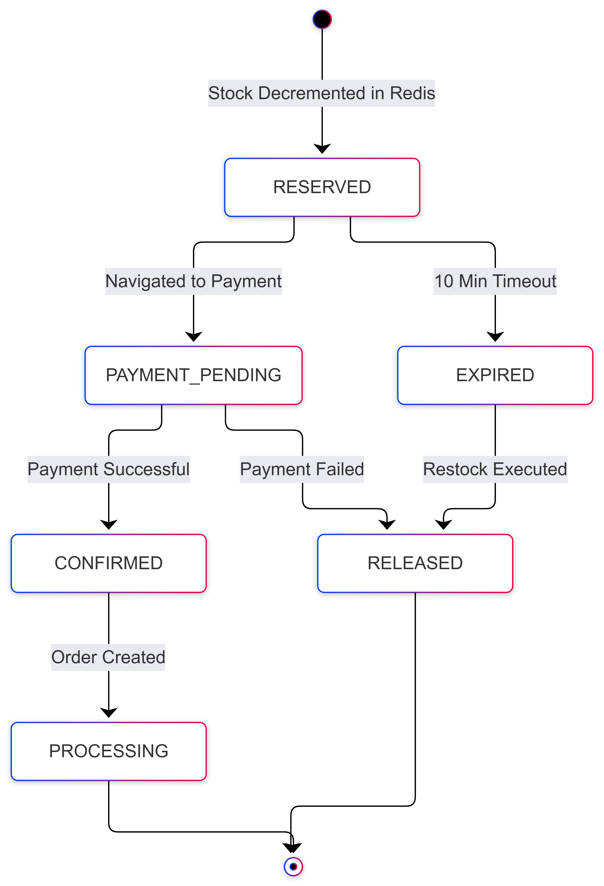

# 03. Low-Level Design (LLD) & Detailed Workflows

## Overview
The Low-Level Design (LLD) details the internal execution logic, class structures, interaction sequences, and state transition rules for the SALESTORM platform[cite: 8, 15]. It guarantees sub-millisecond stock holds via atomic operations, enforces idempotency, and decouples order processing through event messaging[cite: 4, 6, 8, 10].

---

## 1. System Class Diagram
Describes domain entities, interfaces, and microservice relationships[cite: 8, 15].

### Key Components:
- **`InventoryService`**: Executes stock checks and atomic reservations via Redis Lua scripts[cite: 8, 10].
- **`PaymentService`**: Interfaces with external payment APIs using idempotency key verification[cite: 6, 8, 10].
- **`OrderService`**: Asynchronously consumes payment events to record final orders in database storage[cite: 8, 10].

---

## 2. Purchase & Stock Reservation Sequence
Illustrates the sub-millisecond atomic check and decrement flow during high-concurrency checkout[cite: 1, 8, 10, 15].

### Flow Summary:
1. User requests reservation via `/api/v1/checkout/reserve`[cite: 8, 15].
2. `InventoryService` executes an atomic Lua script in Redis (`EVAL decr_stock.lua`)[cite: 8, 10].
3. If stock $> 0$, stock is decremented and reserved for 10 minutes; otherwise, a `410 Sold Out` error is returned[cite: 8, 10, 14, 15].

---

## 3. Payment Processing & Idempotency Sequence
Ensures customers are never double-charged during network retries or duplicate button clicks[cite: 4, 6, 8, 10].

### Flow Summary:
1. User submits payment with a unique `Idempotency-Key` header[cite: 6, 8, 10, 15].
2. `PaymentService` checks database cache for the key[cite: 8, 10].
3. If key exists, it returns the cached response; if new, it charges the external provider and emits a `PaymentCompleted` event to Kafka[cite: 6, 8, 10].

---

## 4. Reservation & Order State Lifecycle
Maps all valid status transitions from initial inventory hold to delivery or expiration[cite: 8, 10, 15].

### State Transitions:
- `RESERVED` $\rightarrow$ `PAYMENT_PENDING` $\rightarrow$ `CONFIRMED` $\rightarrow$ `PROCESSING` $\rightarrow$ `SHIPPED` $\rightarrow$ `DELIVERED`[cite: 10]
- `RESERVED` $\rightarrow$ `EXPIRED` / `RELEASED` (If unpaid after 10-minute TTL or payment fails, stock is automatically restocked in Redis)[cite: 4, 5, 10].