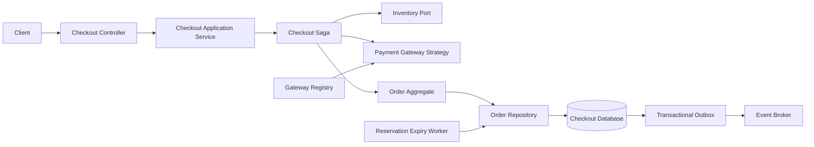
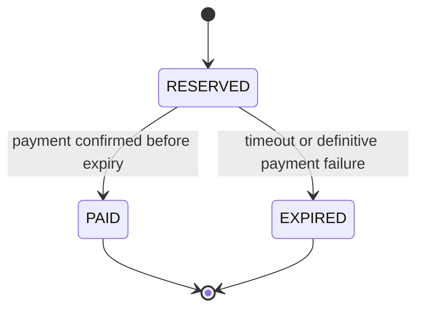

# Checkout Microservice: Low-Level Design

## 1. Purpose and Scope

This document describes the internal design of the SALESTORM checkout microservice. It covers cart-to-order checkout, inventory reservations, payment authorization, order state transitions, idempotency, failure compensation, and the design principles that keep these responsibilities testable and replaceable.

The service coordinates Inventory and Payment; it does not own product catalog data or directly modify inventory counters. Inventory remains the authority for stock availability and performs atomic reservations. Payment gateway adapters own provider-specific request signing, response mapping, and webhook verification. The HTTP contract is described in [`05_API/open_api.json`](../../05_API/open_api.json).

### Design Goals

- Prevent overselling during flash-sale bursts by delegating reservation to an atomic inventory operation.
- Prevent duplicate orders and charges when clients or infrastructure retry requests.
- Keep payment-provider and persistence details behind interfaces.
- Make every multi-service action recoverable through idempotent commands and explicit compensation.
- Record business events reliably without requiring a database and message broker to share a transaction.

## 2. Components and Responsibilities

| Component | Responsibility |
|---|---|
| `CheckoutController` | Validate transport-level input and map application results to HTTP responses. |
| `CheckoutApplicationService` | Coordinate the checkout use case and enforce its idempotency boundary. |
| `Order` | Enforce valid domain transitions and expose order state. |
| `OrderRepository` | Persist orders and perform conditional state updates. |
| `InventoryPort` | Reserve or release inventory through the Inventory service. |
| `PaymentGateway` | Authorize, void, or refund a payment using provider-specific adapters. |
| `PaymentGatewayRegistry` | Resolve a payment strategy for a requested provider. |
| `CheckoutSaga` | Track the cross-service workflow, retries, and compensating actions. |
| `OutboxPublisher` | Publish persisted order/payment events asynchronously and retry safely. |
| `ReservationExpiryWorker` | Find due reservations and request expiration using a conditional transition. |



## 3. Checkout Flow and Invariants

### Successful Checkout

1. The client submits the cart, payment provider, and `X-Idempotency-Key` to `/checkout/reserve`.
2. The controller validates the request shape and authentication, then calls the application service.
3. The service claims the idempotency key using a database uniqueness constraint scoped to the customer and operation. A replay returns the stored result; it does not start another checkout.
4. The saga asks Inventory to reserve all requested lines atomically. Inventory rejects the entire reservation if any line is unavailable.
5. The service creates a `RESERVED` order with a fixed expiration time and persists it. The reservation and order must be associated with stable IDs so retries address the same work.
6. The selected payment strategy authorizes the amount using a provider idempotency key derived from the checkout key. The amount is computed server-side from trusted pricing data and represented as integer minor units plus ISO currency.
7. On successful authorization, the order transitions from `RESERVED` to `PAID` (or to the project’s more detailed payment-confirmed state if capture is asynchronous). The state change and an `OrderPaid` outbox record are committed in one local database transaction.
8. The outbox publisher emits the event. Consumers must be idempotent because delivery is at least once.

If payment is completed asynchronously, `RESERVED` remains the persisted state until the verified provider webhook confirms the authorization/capture. Webhooks are verified against the exact raw body using HMAC-SHA-256, deduplicated by provider event ID, and applied through the same conditional order transition as synchronous results.

### Domain Invariants

- Inventory reservation is all-or-nothing and has one stable reservation ID.
- One idempotency key maps to one logical checkout result. Persist a request fingerprint; reject reuse of the same key with a different request body.
- Payment authorization uses its own stable idempotency key. A timeout is an unknown outcome, not proof that the provider declined.
- State changes use compare-and-set semantics. Only one concurrent worker or webhook can win a transition from `RESERVED`.
- A reservation expires according to an authoritative UTC timestamp. The expiry worker is a trigger, not the source of truth; it must re-check the timestamp and current state before changing anything.
- `PAID` must not be treated as an unpaid reservation that can simply expire and release stock. A paid-order cancellation requires a payment void/refund and a corresponding inventory/business policy.
- Monetary values use integer minor units, never binary floating-point arithmetic.

## 4. Order State Model

For a flash-sale reservation, the safe lifecycle is a branch: `RESERVED -> PAID` when payment succeeds, or `RESERVED -> EXPIRED` when the hold expires or a definitive failure causes the checkout to be abandoned. `EXPIRED` and `PAID` are terminal in this minimal model.

The sequence `RESERVED -> PAID -> EXPIRED` should not be a normal reservation-timeout path. If the product requires an order to expire after payment (for example, a fulfillment deadline), model that separately, and first void/refund the payment. Do not release inventory while leaving a successful charge uncompensated.



### State Pattern (TypeScript)

Each state owns the operations valid from that state. Invalid transitions fail explicitly. Persistence still uses a database conditional update; an in-memory state object alone cannot protect against multiple service instances.

```typescript
type OrderStatus = "RESERVED" | "PAID" | "EXPIRED";

interface OrderState {
  readonly status: OrderStatus;
  pay(order: Order, at: Date): OrderState;
  expire(order: Order, at: Date): OrderState;
}

class ReservedState implements OrderState {
  readonly status = "RESERVED" as const;

  pay(order: Order, at: Date): OrderState {
    if (at >= order.expiresAt) {
      throw new Error("Reservation has expired");
    }
    return new PaidState();
  }

  expire(order: Order, at: Date): OrderState {
    if (at < order.expiresAt) {
      throw new Error("Reservation is not due to expire");
    }
    return new ExpiredState();
  }
}

class PaidState implements OrderState {
  readonly status = "PAID" as const;
  pay(): OrderState { throw new Error("Order is already paid"); }
  expire(): OrderState {
    throw new Error("Paid orders require an explicit refund/cancellation flow");
  }
}

class ExpiredState implements OrderState {
  readonly status = "EXPIRED" as const;
  pay(): OrderState { throw new Error("Expired order cannot be paid"); }
  expire(): OrderState { throw new Error("Order is already expired"); }
}

class Order {
  private state: OrderState = new ReservedState();

  constructor(
    readonly id: string,
    readonly expiresAt: Date,
  ) {}

  get status(): OrderStatus { return this.state.status; }

  markPaid(at: Date): void { this.state = this.state.pay(this, at); }
  markExpired(at: Date): void { this.state = this.state.expire(this, at); }
}
```

The repository persists a transition with an optimistic concurrency guard, for example:

```sql
UPDATE orders
SET status = :next_status, version = version + 1, updated_at = CURRENT_TIMESTAMP
WHERE order_id = :order_id
  AND status = 'RESERVED'
  AND version = :expected_version;
```

Exactly one affected row means the transition won. Zero rows means another operation already changed the order or the expected version is stale; reload and handle the current state rather than overwriting it. Insert the corresponding outbox event in the same database transaction.

## 5. SOLID Principles

The snippets below use TypeScript and show boundaries rather than a full framework implementation.

### SRP: Single Responsibility Principle

Each unit has one reason to change. Request parsing, pricing, order persistence, and email delivery should not be bundled into one checkout class.

```typescript
class CheckoutHandler {
  constructor(private readonly checkout: CheckoutUseCase) {}

  async handle(request: CheckoutRequest): Promise<CheckoutResult> {
    return this.checkout.execute(request);
  }
}

class ReceiptNotifier {
  constructor(private readonly email: EmailPort) {}

  async send(order: PaidOrder): Promise<void> {
    await this.email.sendReceipt(order.customerEmail, order.id);
  }
}
```

Changing HTTP validation belongs in the handler; changing receipt delivery belongs in the notifier. Neither change should require rewriting the checkout workflow.

### OCP: Open/Closed Principle

Add a new pricing rule by implementing the policy interface rather than editing a growing conditional in the checkout flow.

```typescript
interface PricingPolicy {
  adjust(subtotalMinor: number, currency: string): number;
}

class NoDiscount implements PricingPolicy {
  adjust(subtotalMinor: number): number { return subtotalMinor; }
}

class FlashSaleDiscount implements PricingPolicy {
  constructor(private readonly basisPoints: number) {}

  adjust(subtotalMinor: number): number {
    return Math.floor(subtotalMinor * (10_000 - this.basisPoints) / 10_000);
  }
}

class PricingService {
  constructor(private readonly policy: PricingPolicy) {}

  total(subtotalMinor: number, currency: string): number {
    return this.policy.adjust(subtotalMinor, currency);
  }
}
```

Production policy selection should be based on trusted campaign configuration, not a client-supplied discount amount.

### LSP: Liskov Substitution Principle

Every `PaymentGateway` implementation must honor the same behavioral contract: the same input means the same currency/amount semantics, an idempotent retry must not create a second charge, and provider declines must be distinguishable from transient/unknown outcomes.

```typescript
type PaymentOutcome =
  | { kind: "AUTHORIZED"; providerReference: string }
  | { kind: "DECLINED"; reasonCode: string }
  | { kind: "UNKNOWN"; retryable: true };

interface PaymentGateway {
  authorize(input: PaymentAuthorizationRequest): Promise<PaymentOutcome>;
}

class StripeGateway implements PaymentGateway {
  async authorize(input: PaymentAuthorizationRequest): Promise<PaymentOutcome> {
    // Map Stripe's response and exceptions to the shared outcome contract.
    return this.stripeClient.authorize(input);
  }
  constructor(private readonly stripeClient: StripeClient) {}
}

class RazorpayGateway implements PaymentGateway {
  async authorize(input: PaymentAuthorizationRequest): Promise<PaymentOutcome> {
    // Map Razorpay's response and exceptions to the same shared contract.
    return this.razorpayClient.authorize(input);
  }
  constructor(private readonly razorpayClient: RazorpayClient) {}
}
```

An adapter must not turn a timeout into `DECLINED`, throw a provider-specific exception through the interface, or change the meaning of the amount. Those behaviors would break substitutability and could trigger unsafe compensation.

### ISP: Interface Segregation Principle

Callers depend only on the operations they use. A stock display query should not require a client with permission to reserve or release stock.

```typescript
interface InventoryReader {
  availableStock(productId: string): Promise<number>;
}

interface InventoryReserver {
  reserve(items: ReservationLine[], idempotencyKey: string): Promise<Reservation>;
  release(reservationId: string, idempotencyKey: string): Promise<void>;
}

class StockQuery {
  constructor(private readonly inventory: InventoryReader) {}

  get(productId: string): Promise<number> {
    return this.inventory.availableStock(productId);
  }
}
```

This keeps read-only clients small and permits separate authorization, rate limits, and failure budgets for inventory reads versus mutations.

### DIP: Dependency Inversion Principle

The checkout use case depends on domain-owned interfaces, not concrete HTTP clients, SQL libraries, or a particular payment vendor.

```typescript
interface OrderStore {
  createReserved(input: NewOrder): Promise<Order>;
  markPaid(orderId: string, providerReference: string): Promise<boolean>;
}

interface InventoryPort {
  reserve(items: ReservationLine[], key: string): Promise<Reservation>;
}

class CheckoutUseCase {
  constructor(
    private readonly orders: OrderStore,
    private readonly inventory: InventoryPort,
    private readonly gateways: PaymentGatewayRegistry,
  ) {}

  async execute(request: CheckoutRequest): Promise<CheckoutResult> {
    // The application flow uses ports; infrastructure adapters are injected.
    return this.runCheckout(request);
  }

  private async runCheckout(request: CheckoutRequest): Promise<CheckoutResult> {
    // Coordinate the reservation, order, and selected payment strategy.
    throw new Error("Implementation omitted from this interface-focused example");
  }
}
```

Wire `OrderStore` to a database adapter, `InventoryPort` to the Inventory client, and the gateway registry to provider adapters at the composition root. Unit tests can supply deterministic in-memory fakes.

## 6. Strategy Pattern: Payment Gateways

The Strategy pattern makes each provider a replaceable implementation of one stable interface. The registry selects a strategy from validated server-side payment configuration; the checkout use case does not branch on Stripe- or Razorpay-specific fields.

```typescript
interface PaymentGateway {
  authorize(input: PaymentAuthorizationRequest): Promise<PaymentOutcome>;
  void(providerReference: string, idempotencyKey: string): Promise<void>;
  refund(providerReference: string, amountMinor: number, idempotencyKey: string): Promise<void>;
}

class StripePaymentGateway implements PaymentGateway {
  constructor(private readonly client: StripeClient) {}

  authorize(input: PaymentAuthorizationRequest): Promise<PaymentOutcome> {
    return this.client.createAuthorization({
      amount: input.amountMinor,
      currency: input.currency.toLowerCase(),
      idempotencyKey: input.idempotencyKey,
    });
  }

  async void(reference: string, key: string): Promise<void> {
    await this.client.cancelAuthorization(reference, key);
  }

  async refund(reference: string, amountMinor: number, key: string): Promise<void> {
    await this.client.refund(reference, amountMinor, key);
  }
}

class RazorpayPaymentGateway implements PaymentGateway {
  constructor(private readonly client: RazorpayClient) {}

  authorize(input: PaymentAuthorizationRequest): Promise<PaymentOutcome> {
    return this.client.authorizePayment({
      amount: input.amountMinor,
      currency: input.currency.toUpperCase(),
      receipt: input.idempotencyKey,
    });
  }

  async void(reference: string, key: string): Promise<void> {
    await this.client.cancelAuthorization(reference, key);
  }

  async refund(reference: string, amountMinor: number, key: string): Promise<void> {
    await this.client.refundPayment(reference, amountMinor, key);
  }
}

class PaymentGatewayRegistry {
  constructor(private readonly gateways: ReadonlyMap<string, PaymentGateway>) {}

  get(provider: string): PaymentGateway {
    const gateway = this.gateways.get(provider);
    if (!gateway) throw new Error(`Unsupported payment provider: ${provider}`);
    return gateway;
  }
}
```

Provider SDKs shown above are adapter boundaries, not prescribed SDK method signatures. Each implementation must normalize provider-specific decline, timeout, and webhook behavior into the shared domain contract. Apply timeouts, bounded retries only for safe/idempotent operations, circuit breaking, and separate connection pools per provider.

## 7. Saga Pattern: Checkout and Compensation

Inventory reservation and payment authorization span independent services; there is no shared ACID transaction. Use an orchestrated saga with durable step state. The saga coordinator records progress and resumes after process restarts. Every forward and compensation command has a stable idempotency key.

| Forward step | Success record | Compensation |
|---|---|---|
| Reserve inventory | Reservation ID and expiry | Release the reservation |
| Create reserved order | Order ID and version | Mark the order expired/cancelled if still eligible |
| Authorize payment | Provider reference and outcome | Void authorization, or refund if it was captured |
| Mark paid and write outbox event | Paid state and event ID | Refund/void payment and apply the explicit paid-order cancellation policy |

The compensation order depends on which step completed. Never release a reservation merely because a payment request timed out: first query/retry with the same provider idempotency key to resolve whether the payment succeeded. If the provider outcome remains unknown, keep the saga pending and reconcile rather than risk a free order or an uncompensated charge.

### Orchestrated Saga (TypeScript)

```typescript
async function runCheckoutSaga(
  input: CheckoutRequest,
  deps: SagaDependencies,
): Promise<CheckoutResult> {
  const reservationKey = `${input.idempotencyKey}:inventory`;
  const paymentKey = `${input.idempotencyKey}:payment`;
  const releaseKey = `${input.idempotencyKey}:release`;

  const gateway = deps.gateways.get(input.provider);
  const reservation = await deps.inventory.reserve(input.items, reservationKey);
  let order: Order;
  try {
    order = await deps.orders.createReserved({
      customerId: input.customerId,
      reservationId: reservation.id,
      expiresAt: reservation.expiresAt,
    });
  } catch (error) {
    await deps.sagaStore.scheduleInventoryRelease(
      reservation.id,
      releaseKey,
      error,
    );
    throw error;
  }

  let providerReference: string | undefined;

  try {
    const outcome = await gateway.authorize({
      orderId: order.id,
      amountMinor: order.totalMinor,
      currency: order.currency,
      idempotencyKey: paymentKey,
    });

    if (outcome.kind === "UNKNOWN") {
      await deps.sagaStore.markAwaitingReconciliation(order.id, paymentKey);
      return { status: "PENDING", orderId: order.id };
    }
    if (outcome.kind === "DECLINED") {
      await deps.orders.expireIfReserved(order.id, "PAYMENT_DECLINED");
      await deps.inventory.release(reservation.id, releaseKey);
      return { status: "PAYMENT_DECLINED", orderId: order.id };
    }

    providerReference = outcome.providerReference;
    const changed = await deps.orders.markPaidAndWriteOutbox(
      order.id,
      providerReference,
    );

    if (!changed) {
      // Resolve current state before compensation; another webhook may have won.
      const current = await deps.orders.get(order.id);
      if (current.status === "PAID") {
        return { status: "PAID", orderId: order.id };
      }
      await gateway.void(providerReference, `${input.idempotencyKey}:void`);
      await deps.inventory.release(reservation.id, releaseKey);
      return { status: "EXPIRED", orderId: order.id };
    }

    return { status: "PAID", orderId: order.id };
  } catch (error) {
    // A transport exception may mean the provider completed the authorization.
    await deps.sagaStore.markNeedsReconciliation(order.id, paymentKey, error);
    return { status: "PENDING", orderId: order.id };
  }
}
```

The example makes uncertain payment outcomes durable rather than treating every exception as a decline. A reconciliation worker queries the provider with the same idempotency key, then either completes `RESERVED -> PAID` or performs the appropriate void/release compensation. Persist saga step state before acknowledging asynchronous work. Compensation itself may fail, so retry it with backoff and expose stuck sagas through alerts and an operational repair workflow.

## 8. Persistence and Concurrency

Suggested logical records (physical schema may differ):

- `orders`: order ID, customer ID, status, expiry, currency, total minor units, version, timestamps.
- `order_items`: immutable product ID, quantity, unit price, and line total captured at checkout.
- `reservations`: Inventory reservation ID, order ID, expiry, and release/commit status.
- `payment_attempts`: order ID, provider, provider idempotency key, provider reference, normalized outcome, and timestamps.
- `idempotency_records`: customer, operation, key, request fingerprint, processing state, and replayable response; unique on `(customer_id, operation, key)`.
- `outbox`: event ID, aggregate ID/version, event type, payload, created/published timestamps; publisher retries until acknowledged.
- `saga_instances`: saga ID, order ID, current step, retry schedule, and last failure category.

Use database uniqueness constraints as the final guard against concurrent duplicate requests. Keep database transactions short; never hold one open while calling Inventory or a payment provider. The outbox transaction couples local state changes to event publication intent, not to broker delivery. Consumers deduplicate by event ID or aggregate/version.

## 9. Failure Handling and Operational Requirements

- **Inventory conflict:** return `409 OUT_OF_STOCK`; do not create a payable order.
- **Rate limit:** return `429` with `Retry-After`; clients retry with the same checkout idempotency key.
- **Provider decline:** expire the reservation/order and release inventory idempotently.
- **Provider timeout or connection loss:** mark payment outcome unknown and reconcile; do not assume decline.
- **Webhook duplicate:** acknowledge the already-recorded event without applying the transition twice.
- **Webhook with invalid HMAC:** reject before parsing/processing business state; compare signatures in constant time.
- **Late payment after expiration:** void/refund the payment and do not resurrect an expired reservation unless inventory is atomically reserved again.
- **Database unavailable:** fail without acknowledging asynchronous work; rely on client idempotency or broker redelivery.
- **Broker unavailable:** retain the outbox record and retry publication independently of the request thread.

Emit structured logs and metrics keyed by request ID, order ID, saga ID, provider, and idempotency-key hash. Never log full card data, provider secrets, raw signatures, or unredacted payment payloads. Monitor reservation age, payment-unknown duration, compensation retries, outbox lag, duplicate webhook count, and saga instances requiring manual repair. Apply bounded timeouts, retry budgets, circuit breakers, and provider-specific bulkheads.

## 10. Verification Scenarios

- Concurrent requests for the last unit produce at most one successful reservation.
- Repeating the same checkout key and body returns the same order/result without a second payment call.
- Reusing a key with a different request fingerprint is rejected.
- A payment webhook racing with the expiry worker results in one successful conditional transition.
- A payment timeout stays pending until reconciliation resolves it; it does not trigger premature stock release.
- A definitive decline releases the reservation once, even if compensation is retried.
- A late successful payment for an expired order is voided/refunded and never changes the order back to `PAID`.
- Failure after the paid-state database transaction but before event publication is recovered through the outbox.
- Stripe and Razorpay adapters pass the same contract tests for amount/currency mapping, idempotent retries, normalized outcomes, and compensation.
- Invalid HMAC, duplicate webhook event, and malformed webhook payload are rejected or acknowledged according to the API contract without duplicate state changes.